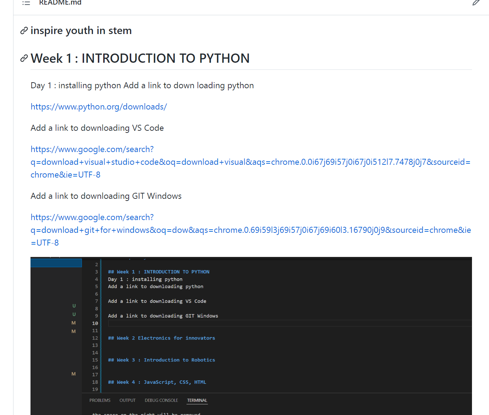
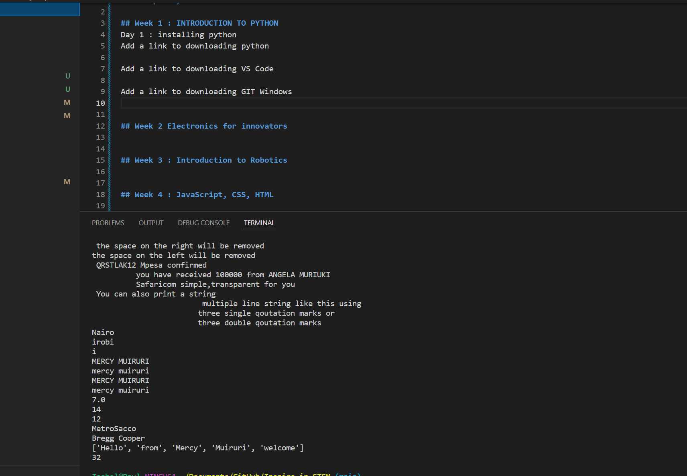
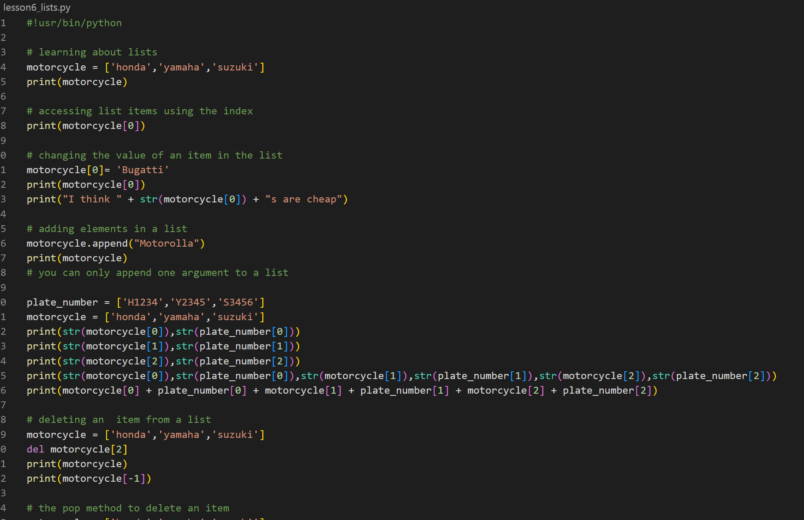
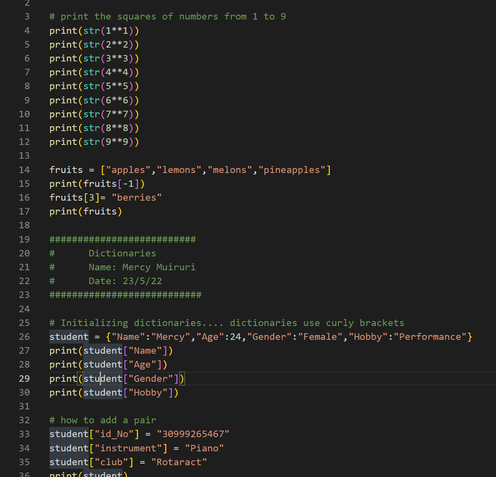

### inspire youth in stem

## Week 1 : INTRODUCTION TO PYTHON
Day 1 : installing python
Add a link to down loading python

https://www.python.org/downloads/

Add a link to downloading VS Code

https://www.google.com/search?q=download+visual+studio+code&oq=download+visual&aqs=chrome.0.0i67j69i57j0i67j0i512l7.7478j0j7&sourceid=chrome&ie=UTF-8

Add a link to downloading GIT Windows

https://www.google.com/search?q=download+git+for+windows&oq=dow&aqs=chrome.0.69i59l3j69i57j0i67j69i60l3.16790j0j9&sourceid=chrome&ie=UTF-8

Git Commands
git add *   (#adding all files) OR git add lesson4.py (#adding a specific file)
git commit -m "assignment4.py"
git branch -m main
git config --global username="MercyWM"
git config --global useremail = "mercywangui895@gmail.com"
git remote add main www.github/MercyWM/Inspire-in-STEM.git
git push main

Day 2: Variables, Arithmetic operations

!
Day 3 : LEARNING ABOUT STRINGS 
strings
adding tabs adding tabs and newlines
multiple line strings
replace()
slice()
length()
split()
concatenation
changing from uppercase to lowercase

Day 4 : LISTS
append
remove
pop method
remove

Day 5 : CAREER TALK
KUCCPS PORTAL

## Week 2 Electronics for innovators

Day 6 : DICTIONARIES
initializing dictionaries
modifying dictionaries
deleting dictionaries

Day 7: LOOPS AND IF STATEMENTS
for loops
if statements
if else statements

Day 8: WHILE LOOPS AND MORE ON DICTIONARIES
creating lists in dictionaries
while loops

## Week 3 : Introduction to Robotics

## Week 4 : JavaScript, CSS, HTML

## Week 5 : Design Thinking, UX, UI

## Week 6 : Critical Division, Campus Tour
